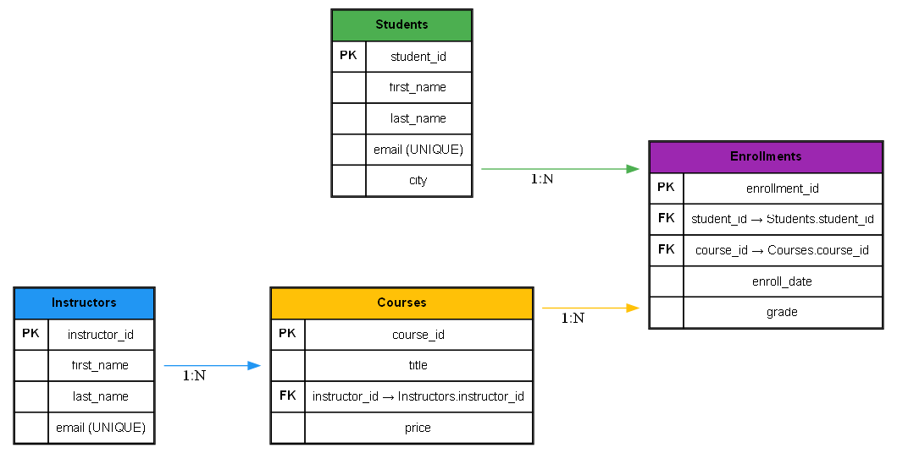

# 🎓 Students Enrollment Database – SQL Joins (Inner, Left, Right, Full)

## Objective
Learn to combine data from multiple tables using SQL JOINs: `INNER`, `LEFT`, `RIGHT`, and `FULL` (and how to emulate FULL where unsupported).

## Tools
- DB Browser for SQLite (SQLite)
- MySQL Workbench (MySQL)

## Deliverables
- SQL queries demonstrating `INNER JOIN`, `LEFT JOIN`, `RIGHT JOIN` (MySQL), and `FULL JOIN` (emulated).
- Example data and schema for Students, Instructors, Courses, Enrollments.

## How to run (SQLite)
1. Open DB Browser for SQLite.
2. Create a new database `online_courses.db`.
3. Execute `schema.sql`.
4. Execute `data.sql`.
5. Open and run queries from `queries.sql` (use the **SQLite** section).

## How to run (MySQL)
1. Open MySQL Workbench and create a schema (e.g. `online_courses`).
2. Run the SQL in `schema.sql` adjusted for MySQL types (CREATE TABLE statements are compatible).
3. Run `data.sql`.
4. Run MySQL-specific queries in `queries.sql` (see the MySQL section for `RIGHT JOIN` and `FULL JOIN` emulation).

## Notes about dialect differences
- **SQLite**: supports `INNER JOIN`, `LEFT OUTER JOIN` (written `LEFT JOIN`), but **does not support** `RIGHT JOIN` or `FULL OUTER JOIN`.
  - Emulate `RIGHT JOIN` by swapping table order and using `LEFT JOIN`.
  - Emulate `FULL OUTER JOIN` using `UNION` of `LEFT JOIN` and `RIGHT`-side `LEFT JOIN`.
- **MySQL**: supports `INNER` and `LEFT` and `RIGHT` joins. **MySQL does not support native FULL OUTER JOIN** — emulate using `UNION` of left/right results.

## Files
- `schema.sql` — schema (Students, Instructors, Courses, Enrollments)
- `data.sql` — sample data
- `queries.sql` — join examples (clearly labelled for SQLite and MySQL)
- `online_courses.dot` — Graphviz DOT file to render ER diagram
- `docs/er_diagram.png` — (render this from the DOT file)

## ER Diagram
Here’s how everything is connected:

## Outcome
After this project you'll be able to:
- Combine tables with `JOIN`s
- Understand LEFT vs RIGHT vs INNER semantics
- Emulate FULL OUTER JOIN where not available

